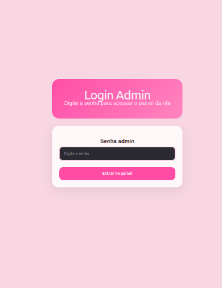
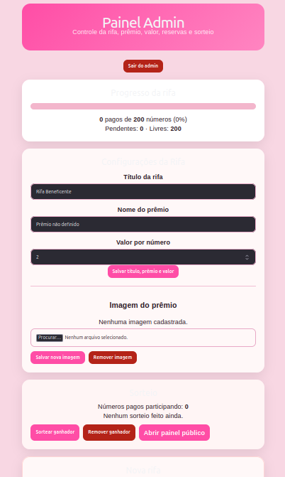
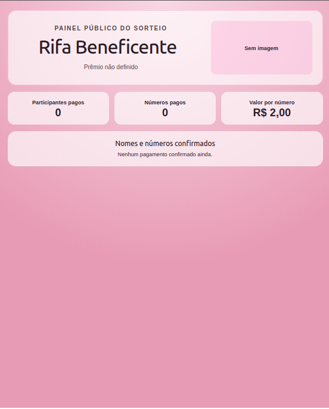
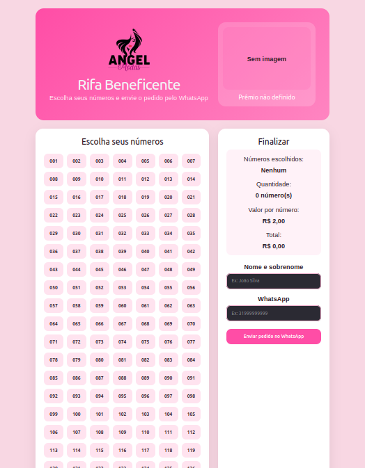

# 🎟️ Raffle App (Fullstack)

A complete raffle (ticket sales) system with admin dashboard, ticket tracking and payment management.

## 🚀 Features

- Admin login with authentication
- Ticket selection and order system
- Payment confirmation (manual control)
- Real-time raffle progress
- Winner draw system
- Image upload for raffle items
- Persistent data using SQLite

## 🧠 Tech Stack

- Frontend: React + Vite
- Backend: Node.js + Express
- Database: SQLite (better-sqlite3)
- Other: Multer (uploads), CORS

## 📸 Preview






## ⚙️ How to Run Locally

### Backend

```bash
cd backend
npm install
node src/server.js
